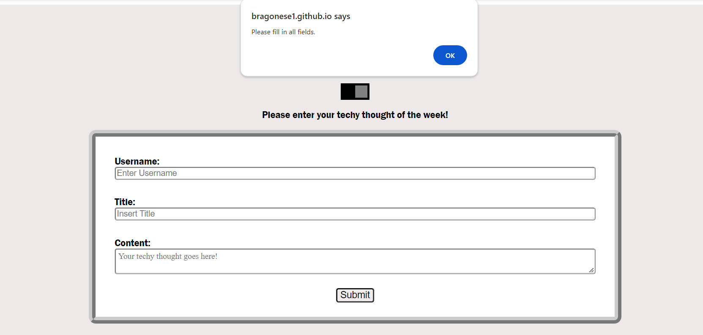

# Tech Log Blog

## Description

The Tech Log Blog is a blog form whose purpose is to allow the user to enter their techy thought of the day. After submission, their blog post will be saved along with previous post on the blog post page.

## Links
- https://github.com/bragonese1/tech-log-blog
- https://bragonese1.github.io/tech-log-blog/


## Installation
```md
Two-page platform created using HTML, CSS, and Javascript
```

## Usage
When a user wants to submit a blog post they enter their name, the title, and the content. If the fields are left empty, a window alert will pop up. After pressing submit, they are then redirected to another page containing their blog posts. After the user is done reading their blog posts, they can then use the back button to go back to the form submission page and submit another form. There is also a unique feature in the shape of a switch. Once that switch is toggled, the user is then greeted with a change in color and styling. Last but not least, there is a portfolio link located at the bottom that will take you to the creators portfolio.




